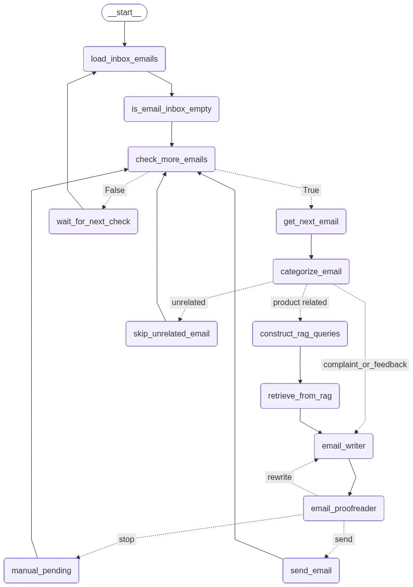

# mail-robot
> 一个基于 LLM 的邮件机器人,能自动完成客户邮件的分类、回复生成、内容校对和发送全流程，帮客户支持团队节省重复工作时间。

## 核心功能
- **自动邮件分类**：根据内容识别邮件类型（产品咨询 / 投诉 / 反馈 / 无关），确保后续处理精准高效。  
- **智能回复生成**：结合 RAG（检索增强生成）技术，从知识库中提取相关信息生成专业回复，避免出现编造内容。  
- **回复质量校对**：自动检测回复内容是否准确、语气是否得体，不符合标准时会自动重新生成。  
- **全流程自动化**：从加载未读邮件到发送回复形成闭环，异常情况自动进入人工处理队列，确保客户问题得到及时响应。  
- **可扩展架构**：模块化设计，支持新增邮件类型、调整回复规则，兼容多种 LLM 模型。

## 系统架构图
<p align="center">
  
</p>

## 快速开始
1. 克隆项目到本地
```bash
git clone https://github.com/your-username/mail-robot.git
cd mail-robot
```

2. 安装依赖：
```bash
pip install -r requirements.txt
```
3. 配置环境变量：复制.env.example为.env，填写必要参数：
```bash
cp .env.example .env
```
4. 初始化知识库：
将产品文档（.txt 格式）放入data/目录，执行脚本生成向量索引：
```bash
python create_docs.py
```
5. 启动服务：
```bash
python main.py
```

## 技术栈
* 核心框架：Langgraph（LLM 工作流管理）
* 存储：MySQL（元数据）、Redis（状态缓存）、Chroma（向量存储）
* 消息队列：RabbitMQ（手动处理任务分发）
* 邮件协议：SMTP（发送）、IMAP（接收）
* LLM 集成：支持 OpenAI 兼容接口、阿里云通义千问等
* 其他工具：Pydantic（数据校验）、python-dotenv（环境配置）


## 目录结构
```bash
mail-robot/
├── src/
│   ├── chains.py        # LLM链定义（分类、生成、校对）
│   ├── graph.py         # 状态流图（控制整体工作流程）
│   ├── nodes.py         # 流程节点实现（加载邮件、发送等）
│   ├── rag.py           # RAG引擎（检索增强生成）
│   ├── prompts_zh.py    # 中文提示词模板
│   ├── tools/           # 工具类（邮件处理、数据库操作等）
│   └── utils/           # 通用工具函数
├── data/                # 知识库文档（.txt）
├── vector_db/           # 向量数据库存储目录
├── create_docs.py       # 初始化知识库脚本
├── main.py              # 主程序入口
└── test_mail.py         # 邮件功能测试脚本
```
