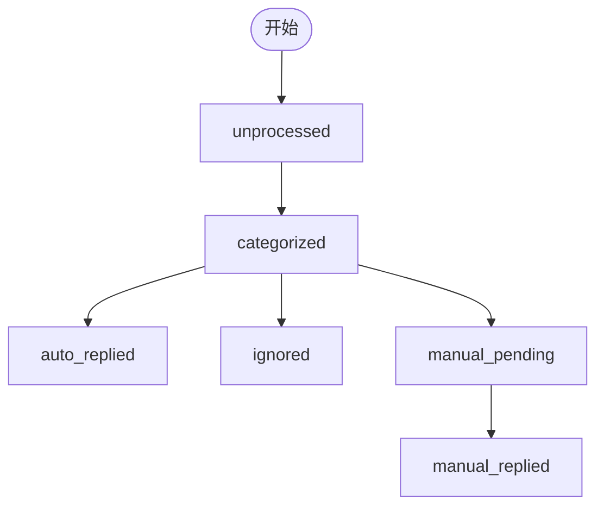

## 邮件状态
1. unprocessed 新读取的邮件 未处理
2. auto_replied 已自动回复的邮件
3. manual_pending 需人工处理（如复杂问题）
4. ignored 已忽略的邮件（如垃圾邮件）

### 状态转换图

```mermaid
graph TD
    start([开始]) --> a[unprocessed]
    a --> b[categorized]
    b --> c[auto_replied]
    b --> f[ignored]
    b --> d[manual_pending]
    d --> e[manual_replied]
    
```

